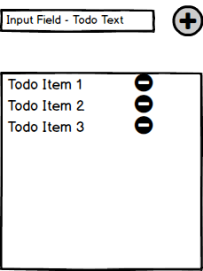

# TodoList Application in React
Description: Creation of a basic TodoList React application from scratch

In this lab we will be building a simple todo list in React. There is no Redux piece.

We will have gone through a bit during class, but you will need to make your own from scratch. I created a boilerplate from using `create-react-app`, added in some linting and pre commit rules.

- **What you will learn**
  - How to create React components
  - How React components fit together
  - How to pass data betweeen components

- **Required**
  - All the Milestones below are required
  - All of you code should pass linter

## Submission Instructions
1) Create a PR from your fork. [Here's some documentation](https://help.github.com/en/articles/creating-a-pull-request-from-a-fork).
2) Add label `week-2`
4) Include link to screencast of you demoing app (i use screen-o-matic, but you can use anything)

## Strategy
Note that we will be giving you the boilerplate for all the components in Milestone 2 - so you will NOT have to create any of these components on your own.



Let’s use the TodoList app mockup above to help us decide how to break the app down into separate React components.
- We’ll need a container component that holds everything - including the actual list of todo items.
- We could say that the input field and add button could be a part of an AddTodo component.
- We would also want a component to hold the list of Todos.
- Each todo item in our list could be it’s own component. The above list would act as a parent component for these todos.
<br/>

So, as we described above the 4 components are:  
- The `TodoApp` component, which acts as a container for everything
- The `AddTodo` component, representing the input field and add button
- The `TodoList` component, representing the list of Todo items
- The `Todo` component, representing each Todo entry

Let’s also throw in a very simple `Title` component that will just display a title for our Todo List

That gives us a total of 5 components.  
<br/>

***Functional pieces of our TodoList***  
Functionally, what would we expect from our Todo list?  Here's a list of features:
- `Add` a new todo to our list
- `Remove` a todo from our list
- An `input` field to add new todo’s.
- Have some form of `storage` to save all the todos in our current list (think React state)

<br/>

***Linting***
We will be using [ESLint](https://github.com/typescript-eslint/typescript-eslint) with a typescript parser and rules. We will also use [husky](https://github.com/typicode/husky) for precommit hook that runs the linter. If there are any issues you need to address them! 

## Milestone 1: Fork my repo
As mentioned above, I created a boilerplate for this session. It is based off a base `create-react-app` boilerplate, but I added some typescript eslint and commit hooks.

You will need to fork my repro, after forking my repro you will need to clone your fork down.

At this point you should have `nvm` installed so you will need to use the version I'm using by running:

```bash
$ nvm use
```
once you are on the correct version, you can run the install

```bash
$ npm install
```

Once the install completes, change into the project directory and run `npm start`, and if you navigate to [localhost:3000](http://localhost:3000) you will see a small Demo component that's included as part of the app generator.

## Milestone 1.5: Clean Up Demo Files
The code for that demo component is inside `src/App.tsx`. The entry point for the app is `src/index.ts`. Open `index.ts` and let’s take a look at the contents.

On `line 7` you’ll see the invocation of` ReactDOM.render` with the original demo `App`. This is how a React App is bootstrapped. `ReactDOM.render` will mount the html element produced by `App` on the specified DOM node, the one with id `root`. You can confirm that node exists by opening up `public/index.html`. You’ll notice the only markup in the `<body>` is 
```html
<div id="root"></div>
```
Don’t be surprised that `index.ts` is not referenced here; create-react-app uses Webpack under the hood to bundle all of your app’s javascript together, by starting at `src/index.ts` and following all the `import` statements recursively. Then Webpack injects a script tag into `index.html` for each bundle produced. We can prove this is the case by inspecting the html in the browser.

If your dev server is not running, start it with `npm start` then open the devtools in the browser tab that opens up. In the `Elements` tab, confirm that there are now script tags in the `<body>`.

Now let’s clean up the demo code before beginning our app. First, stop your sever. Then, delete all the files in the `src` directory except `index.ts`. Since this is the entry point for all of our javascript we’ll still need this. However, we’ll need to remove the references to all the files we deleted. Remove the comments and code after line 7  since we won’t be using service workers, and remove all the `import` statements except `React` and `ReactDOM`.

The last thing we’ll do is modify the `render` method to use a different component which we will create in the next milestone. Replace `<App />` with `<TodoApp />`, then add an import statement at the top of the file:
```jsx
import TodoApp from './todo-app';
```
Now we're ready to build our app.


## Milestone 2: Component Boilerplate
We will now give you some boilerplate (stub code) for our components. We’ll start with our app container component.

Create a file named `todo-app.tsx` under the `src` directory. The approach we will take is top-down – first we will build out our stateful container components and then we will build out our presentational components.


### Create app container component
Inside your `todo-app.tsx` file copy this code:

```jsx
import React, { Component } from "react";
import Title from "./title";
import AddTodo from "./add-todo";
import TodoList from "./todo-list";

class TodoApp extends Component {
  constructor(props) {
    super(props);

    //initialize state - `todos` is our initial dummy array of todos
    this.state = {
      todos: [
        { text: " This is a simple todo list app written in React!", id: 1 },
        { text: "Hover over todos and click on the `XX` to delete them!", id: 2 },
        { text: "Add new todos if you like!", id: 3 }
      ]
    };

    // binding methods
    this.addTodo = this.addTodo.bind(this);
    this.removeTodo = this.removeTodo.bind(this);
  }
  // Handler to add a todo
  addTodo(todo) {
    // your code here
  }
  // Handler to remove a todo
  removeTodo(id) {
    // your code here
  }

  render() {
    return (
      <div>
        <Title />
        <AddTodo handleAdd={this.addTodo} />
        <TodoList todos={this.state.todos} handleRemove={this.removeTodo} />
      </div>
    );
  }
}

export default TodoApp;
```
> Notice how we bind our methods to this. This is necessary because these methods will likely make a reference to the keyword this, which we would expect to resolve to the instance of the TodoApp component. In JavaScript, class methods are not bound by default, so when we pass a method reference as a prop to children components (eg. handleAdd to AddTodo and handleRemove to TodoList) the method looses its context. See [here](https://reactjs.org/docs/handling-events.html) for more details.  

`TodoApp` is our top level component. You can see that our `TodoApp` component will maintain the list of todo items, utilizing React component state. We used a class component to be able to maintain state. Initializing state can be done in the constructor, but this is the only time you should directly assign the state property. During the component’s lifecycle you should always interact with its `setState` method which triggers React’s rerendering machinery, keeping the UI updated. We’ll use the `setState` method later as we start adding and removing todos.


### Create `AddTodo` component
Inside the render method of `TodoApp`, you can see that we use a component called `AddTodo`. Create a file `add-todo.tsx for the component. This component will contain a `form` element that the user will use to add todos. The typical pattern for implementing form elements in React is called `controlled components`. We’ll explore that in more detail in a subsequent milestone. For now, take note of the component’s state and the the input element’s attributes.

```jsx
import React, { Component } from 'react';

class AddTodo extends Component {
  constructor(props) {
    super(props);
    this.state = {
      todoText: ''
    };

    this.handleChange = this.handleChange.bind(this);
    this.handleSubmit = this.handleSubmit.bind(this);
  }

  handleChange(event) {
    // your code here
  }

  handleSubmit() {
    // your code here
  }

  render() {
    return (
      <div className="row">
        <input
          type="text"
          value={this.state.todoText}
          placeholder="Add todos here..."
          autoComplete="off"
          onChange={this.handleChange}
        />
        <button onClick={this.handleSubmit}> + </button>
      </div>
    );
  }
}

export default AddTodo;
```
> Notice this is also a class component. We’re using a class to manage the state of the input field.


### Create TodoList component
Next, create a file for the `TodoList` component called `todo-list.tsx`. Add this code to your `todo-list.tsx` file:

```jsx
import React from 'react';
import Todo from './todo';

const TodoList = ({ todos, handleRemove }) => {
  function renderList() {
    // check if there are todos -- provide useful message if no todos left
    if (todos.length > 0) {
      return todos.map(todo =>
        <Todo todo={todo} remove={handleRemove} key={todo.id} />
      );
    }
    return <h3>No Todos remaining!</h3>;
  }

  return (
    <div>
      <p><b>Your Todos:</b></p>
      {renderList()}
    </div>
  );
};

export default TodoList;
```

> Because `TodoList` will just ***display*** a list of Todos it receives as `props`, it won't need to maintain any state. Therefore, this is a perfect candidate for a simple function component using ES6 arrow function syntax. Notice the use of `map`. This is a classic React pattern for rendering a collection. The `key` prop should be provided since React’s diffing algorithm can optimize rerendering with it. You may see tutorials use the array index as the id, which may be fast and simple, but can hurt performance and produce subtle bugs if the position of the elements in the array is not stable (such as the case in a todo list where todos can be deleted from anywhere in the list, shifting elements that follow the deleted one forward) Read more in [the docs](https://reactjs.org/docs/lists-and-keys.html#keys)


### Create Todo component
Note that your `TodoList` component code uses a `Todo` component. Let’s add the stub code for that component as well in a file called, you guessed it, `todo.jsx`:

```jsx
import React from 'react';

const Todo = props => (
  <p>
    {props.todo.text}
    <span
      onClick={()=> {
        //add your code here
      }}>
    <b>&nbsp;XX</b>
    </span>
  </p>
);

export default Todo;
```

> `Todo` represents a single todo item.  It's just a simple presentational component that takes in the todo as prop and then renders  the text as part of the markup. Note that the `<span>` with an `onClick` attribute will be how todos are deleted. You’ll write this logic a bit later.


### Create Title component
Finally, let’s add a simple `Title` component - you’ll notice that we used it in the top level app container. This time you get to try it on your own. Create `title.tsx` and write your code there. Your component needs only to produce the name of your app – maybe `Todo, or not Todo` for something silly, although the perfunctory `Todo List` will do just fine – make it your own!


## Milestone 3: Test the App
Now that all the components are created your code should compile. If you aren’t already, run `npm start` and go to [http://localhost:3000](http://localhost:3000) where you should see the Todo App running. But nothing really works since we haven’t implemented any of the handlers. Now, your job begins.

Let’s get started on the following exercises to produce a Todo application that works as we described above.


## Milestone 4: implement handleChange
Taking a look at your Todo list application running at [http://localhost:3000](http://localhost:3000) you'll notice that the `input` field currently doesn’t respond to your input!

The reason it doesn’t work as expected is because we left the `handleChange` event handler blank inside the `AddTodo` component. This is the first functionality for you to complete -- your goal is to get the `input` field to simply accept some input.

This input element is set up as a Controlled Component. You can read up on [Controlled Components](https://facebook.github.io/react/docs/forms.html) and forms in React to complete this exercise. **Hint:** in the provided component code notice the input field's value attribute is set equal to `this.state.todoText`.


## Milestone 5: implement handleSubmit
Once you get the `<input>` field actually accepting inputs, adding todos still doesn’t work. This is because inside the `AddTodo` component, the `<button>` was assigned `handleSubmit` as its `onClick` handler, but the method is an empty stub. This is the next exercise for you to complete. When the add button is clicked, we need to create a new todo and add it to the list. Remember the list of todos is in the `TodoApp` component so we'll need to use a callback to pass data back up to the parent from `AddTodo`.

**Hints**
<details markdown="1">
  <summary>We don’t want to create empty todos.</summary>
  Check for text in the `<input>` field. Try using [trim](http://mdn.io/trim).
</details>
<details markdown="1">
  <summary>Use the props the component is receiving</summary>
  You’ll need the `addTodo` function defined in the parent `TodoApp` component - remember this is being passed as a prop named `handleAdd` to the `AddTodo` component.
</details>
<details markdown="1">
  <summary>Generate a unique ID for each todo</summary>
  A quick and dirty way to generate a unique `id` is to use `new Date().getTime()` which will return a Unix Time Stamp. *Note:* this is safe for our purposes but not a production app.
</details>
<details markdown="1">
  <summary>After adding the todo, what should the input look like?</summary>
  Clear out the `<input>` field's value after the user submits the new todo. Remember this is a controlled component.
</details>


## Milestone 6: implement addTodo
Unfortunately we still can’t add todos becasue the `addTodo` function is also just a stub. In `TodoApp` add the appropriate logic to `addTodo` so that the `todo` passed in as an argument is added to the todo list stored in the component’s state. Make sure you try adding todos and confirm they are appended to your list.

**Hints**
<details markdown="1">
  <summary>Don't mutate the existing state</summary>
  Try using the ES6 `spread` operator to produce a new list when a todo is added
</details>
<details markdown="1">
  <summary>Don't loose existing todos!</summary>
  Be sure to use reference the current state when creating an updated list that contains the todo we are adding.
</details>
<details markdown="1">
  <summary>Rerendering should be triggered automatically</summary>
  Use `setState` to update the component state with your new list and trigger rerendering.
</details>

## Milestone 7: implement removeTodo
Now that we have the add functionality working, we need to implement the remove functionality so that a user can easily remove a todo item from the list by clicking on the `XX` next to each todo item.  

In our component hierarchy, `TodoApp` is the parent of `TodoList` and passes it the function called `removeTodo` as a prop with the name `handleRemove`. Then `TodoList` passes `handleRemove` to the `Todo` component as a prop with the name `remove`.  Note that `TodoList` doesn't do anything with the `handleRemove` callback - it's really just an intermediary in the passage of the callback. So, the handler function gets passed from the `TodoApp` grandparent component down to it's grandchild `Todo`.

### Understanding the design

Why was it designed in this way?  Why are we passing the callback through props two components down in the hierarchy?

Well, our `TodoApp` component is our stateful component which maintains the list of todo items utilizing React component state. The list of todos must be kept at the `TodoApp` level becuase both the `AddTodo` and `TodoList` components depend on that data. Since sibling components can't share data we must promote it to a common parent component. Because `TodoApp` contains the data, it is necessary that the handlers for operating on that data--namely adding and deleting todo items--are defined on this component too, where the data they manipulate is in scope.

But, each todo item in our list is represented by the `Todo` component - a presentational component used to simply display the text for a given todo item and also a delete button. Since this component lacks direct access to the list of todos, the delete button’s click handler needs to use a callback function that *can* access the list. The `TodoApp` grandparent component has access to the list, so the appropriate logic is defined there and passed down the component hierarchy as `props` to ultimately be used by `Todo` in its `onClick` handler.


### Challenge details
Now your challenge is to first implement the `removeTodo` function in `TodoApp`. Then implement `Todo`’s `onClick` using the handler it recieves as a prop.

**Hints**
<details markdown="1">
  <summary>How do you specify the todo that is being removed?</summary>
  Notice the `removeTodo` function expects to be invoked with the todo’s `id` as an argument.
</details>
<details markdown="1">
  <summary>Don't mutate the existing state or loose existing todos!</summary>
  Be sure to use reference the current state when creating an updated list without the todo we are removing.
  Try using the [filter array method](http://mdn.io/filter) to produce a *new list* that excludes the specified todo.
</details>
<details markdown="1">
  <summary>Rerendering should be triggered automatically</summary>
  Use `setState` to update the component state with your new list and trigger rerendering.
</details>


## Milestone 8: Destructuring our props
If you take a look at your `Todo` component you'll notice we just have a simple functional component that takes in some `props` and then returns some markup using the `props` data:

```jsx
// our abbreviated Todo component:
const Todo = props => {
  return (
  // use props here to return some JSX...
  // ...
  );
};
```

We could also use ES6 destructuring with our props.  Here's an example of what that would look like:

```jsx
//curly braces for destructuring
const DestructuredComponent = ({prop1, prop2}) => {
  return <h1>Hello, {prop1} {prop2}</h1>;
};
```
Now, your challenge is to implement ES6 destructuring in the `Todo` component to destructure the props passed in.  That way, your code will be cleaner, and you won't have to access the properties from the `props` object (ie. `props.remove` or `props.todo`). Instead, you can directly reference `remove` and `todo`.


## Milestone 9: Styling our components
Our app works great, but it doesn’t look great. Let’s use [CSS Modules](https://github.com/css-modules/css-modules) to make our interface a little bit easier to use and understand. We can use a CSS framework [Milligram]("https://milligram.io/"), along with some of our own styling rules to prettify our to-do app.

First install Milligram
```bash
$ npm install milligram
```

Next create a new file `src/todos.module.css` and fill it with some very basic, but noticeable CSS.

```css
.addTodos {
  background: red;
}
```

Then in `add-todo.jsx` import the css module.

```jsx
import styles from './todos.module.css';
```
CSS Modules allow you to assign your custom styles to a component within the JSX by specifying the className you’d like to assign to that component. When Webpack imports the CSS file it produces a Javascript object that maps the class name you defined in the CSS to a unique hash. This virtually guarantees there will be no style conflicts in your app since all of the hashes are namespaced by file. Add the following attribute to the button tag.

```jsx
<button className={styles['addTodos']} onClick={this.handleSubmit}>
```

Refresh the page and confirm that your add todo button is now a horrific red. The CSS Module works and you can inspect the button to see the hash that was generated. But nobody is going to want to click that! Instead, let’s use Milligram’s `button-outline`. First, lets import Milligram as global styles. Go to `index.ts` and add

```js
import 'milligram';
```

Milligram will be available as global styles so you can apply class names to your jsx to use them. For example back in `add-todo.jsx` replace the className you just added with:

```jsx
<button className="button button-outline">
```

Now your button should look a lot more button-y. Notice that for Milligram we aren’t using CSS Modules. Create React App uses the `[name].module.css` file name convention to process CSS as Modules. Otherwise it is loaded as a regular stylesheet.

Take this time to mix in some basic Milligram boilerplate CSS with some of your own custom CSS. Add your custom css to `todos.module.css` and use the original pattern we used when we made the button red. If you are using Milligram styles, just add the appropriate classes. Here are a couple of suggestions:
- Make the add todos textbox a bit more prominent. This should be a focal point of your app.
- Make the delete todo button more intimidating. Users should be fully aware of the consequences of clicking it just by looking at it.
- Try to use some of the extra white space on the screen.
- Refactor the markup as needed